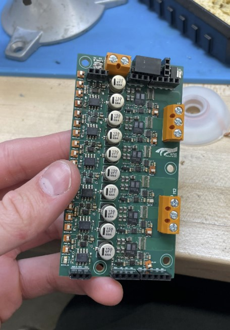

# Charlie's GaNFET Motor Driver

## Complete documentation for this board can be found [here](https://github.com/NU-RDS/rds25-project/blob/main/Electrical_Documentation/RDS%202025%20Motor%20Driver%20Documentation.pdf).

Specs:

| Spec         | Details                              |
|------------------|--------------------------------------|
| # of Motors | 2 |
| Input Voltage              |   12-24V        |
| Phase Current              |     24A max continuous      |
| Control Interface(s)       |       PWM @ up to 40kHz*    |
|Sensing             |      Phase V (analog) & I (SPI)    |
| Current Sensing Throughput           |       1MSPS    |

*\* indicates untested.*

---

  
📷 Click to view the Motor Driver

  

Major Features:

| Feature       | Reason        | Notes                     |
|------------------|-------------|-------------------------|
| Dead Time Control  |    Selected half-bridge does not include protection       |           Functions as intended          |
| GaN Half Bridge      |     Fast switching speed to enable high-speed control      |          Built-in gate drive circuitry          |
| Shunt Resistors  |     Accurate and simple current sensing      |                    |
| INA241 current sense amplifier | High CMRR, simple to integrate, cheap, widely available | |
| ADS7044 SPI ADC    |     20x faster than Ivor's, prior experience      |          1MSPS          |

The BOM and Schematics can be found in the [project in the Telerobotics Altium workspace](https://yufeng-yang.365.altium.com/designs/1C79E01F-E16E-4C25-9A8B-15B832A2B849?activeView=SCH&activeDocumentId=dead_time.SchDoc(4)&variant=[No+Variations]&location=[1,90.62,-65.95,53.17]#design).
