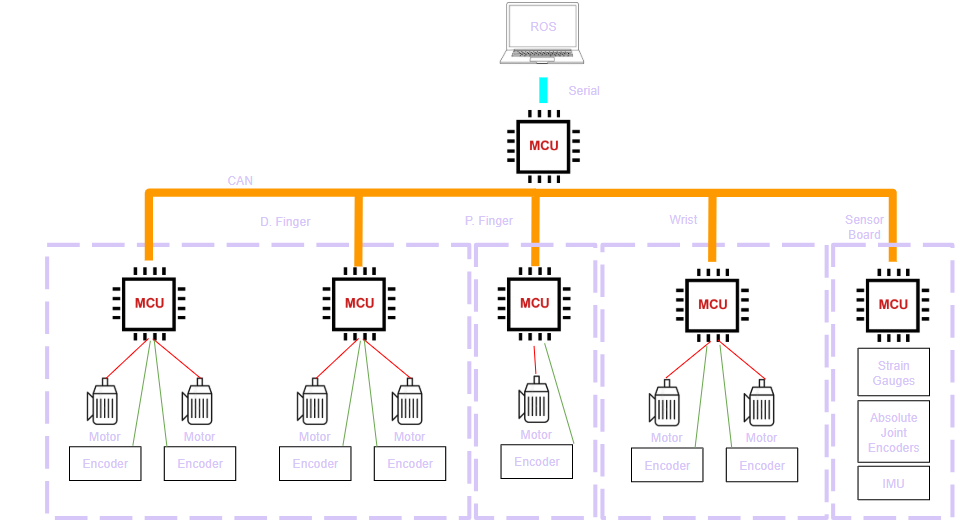
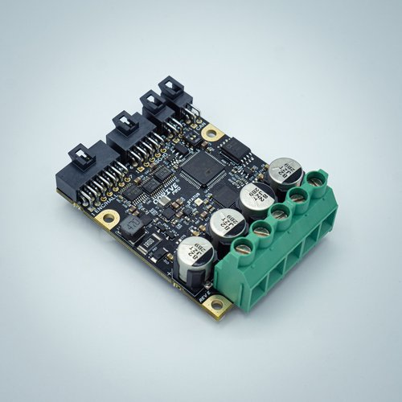
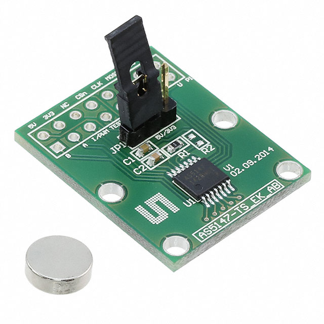
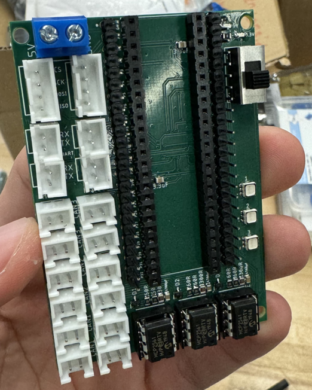
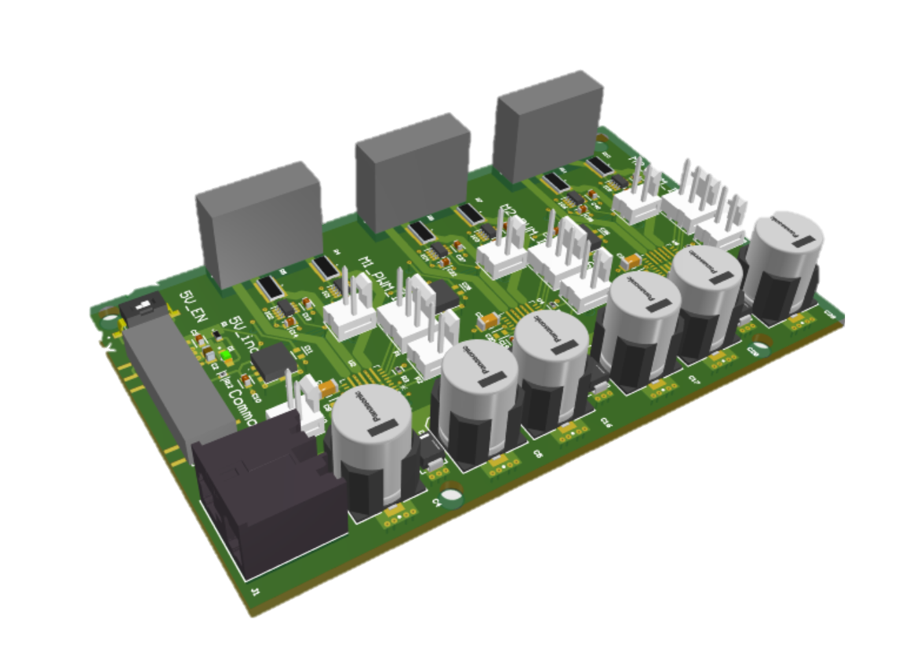
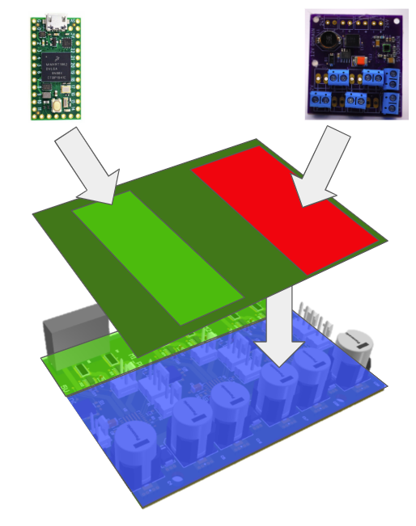

# Electrical Engineering Project Documentation Wiki

Welcome to the final documentation portal for RDS 2025 Electrical Team. This wiki provides a comprehensive view of the system architecture, development process, challenges faced, and recommendations for future iterations.

---

## Table of Contents

| Section                             | Description                                                 |
|-------------------------------------|-------------------------------------------------------------|
| [1. Original Architecture](#1-original-architecture)     | Initial ebedded system design, the primary driver of electrical hardware decisions |
| [2. Existing Tooling](#2-existing-tooling)               | The motor drivers, position sensors, MCU, and power domain tools alreafy in place as of 1 April 2025 |
| [3. Project Goals](#3-project-goals)                     | The Design Parameters, goals, plans, and backup plans we agreed upon for Spring quarter '25    |
| [4. Project Plans and Backup Plans](#4-project-plans-and-backup-plans) 
| [5. Project Outcome](#5-project-outcome)                 | Summary of results, deliverables, and performance           |
| [6. Issues and Painpoints](#6-issues-and-painpoints)     | Technical and procedural blockers encountered, and how we overcame them |
| [7. Future Work](#7-future-work)                         | Suggestions for extending and improving the project         |
| [8. Recommendations for Future Teams](#8-recommendations-for-future-teams) | Practical advice from this iteration, and how to pick up where we left off |
| [9. Appendix 1 Link to Drive and Altium Files](#9-appendix-1-link-to-drive-and-altium-files) | Links to our other shared resources |

---

## 1. Original Architecture

| Component         | Details                              |
|------------------|--------------------------------------|
| High-Level Control             | Laptop running ROS                      |
| Mid-Level Control              | Teensy 4.0             |
| Low-Level Control              | Teensy 4.0        |
| Joint Encoders                 | AS5047P to agggregating sensor board (palm board)     |
| Motor Encoders                 | AS5047P straight to mid-level teensy    |
| Power Domain                   | Power Distribution Board |
| Palm Board                     | Sensor Aggregation |

---

  
📷 Click to view Original System Diagram

  

---

## 2. Existing Tooling

| Component         | Details                              |
|------------------|--------------------------------------|
| Motor Driver & Logic/Control  | ODrive Pro            |
| Motor Driver                  | Ivor's Master's thesis, V1 and V2     |
| Power Distribution            | RDS2024 PDU           |
| Logic / Control               | RDS2024 Teensy 4.1 breakout board       |
| Position Sensing              | Pre-fabbed encoder boards from Mouser |

---

  
📷 Click to view ODrive

  

  
📷 Click to view Pre-fabbed Encoder

  

  
📷 Click to view RDS '24 Teensy 4.1 Breakout

  

  
📷 Click to view RDS '24 Power Board

  

  
📷 Click to view Ivor's Motor Driver

  

---

## 3. Project Goals

Our primary objective for Spring 2025 was to **consolidate disparate electrical subsystems** into a **modular, unified PCB stack** 

The existing tooling had several known drawbacks.

| Existing tool | Drawback |
|----------------|----------------------------|
|ODrive |Finicky SPI connectors, Exclusive support list for peripherals, Wasted Z space, Limited power output, Only drives one motor |
|Ivor's Boards | No Logic domain |
|Teensy 4.1 |Large Footprint, finnicky readily accept wire harnesses |
|RDS '24 PDU |Separate from other boards, does not readily accept wire harnesses |
|Prefabbed encoders|Large footprint, does not readily accept wire harnesses |

Our design goal was structured for **stackable, role-specific PCBs**, easing debugging, replacement, and scalability. The final layout aggregates all functional blocks into a clear topological arrangement, as shown below. Specifically, we wanted to handle:

| Domain                    | Responsibilities                                       |
|---------------------------|--------------------------------------------------------|
| 🟧 **Power Domain**        | 24V input → 5V regulation and stable power delivery    |
| 🟦 **Switching Domain**    | 40kHz gate driving and isolation switching logic       |
| 🟩 **Logic & Communication** | SPI, CAN, and MCU interfacing for control & telemetry |

  
📷 Click to view Modular Control Goal Diagram

    
  **Figure 3.** Modular PCB stack: domain separation by function with visual overlays and control pathways highlighted.

We defined success as:
- A **working modular board system** with power, logic, and switching blocks  
- Compatibility with **existing Teensy-based controllers**  
- Future-ready for **multi-channel motor drivers**

---

## 4. Project Plans and Backup Plans

| Plan Order       | Status / Result                      |
|------------------|--------------------------------------|
| A                |  Our custom board interfaces with a controlling teensy, and talks over CAN to a palm sensor board which aggregates data over SPI from encoders|
| B                |  Use our daughter board with Ivor's V2 motor driver |
| C                |  Use our daughter board with Ivor's V1 motor driver |
| D                |  Resort back to Odrive and any combination of logic which is compatible with that architecture|

---
## 5. Project Outcome
What we made!

| Component                  | Status / Result                                              |
|---------------------------|--------------------------------------------------------------|
| [Motor Driver & Logic/Control](MotorDriver.md) | Charlie's custom GaNFET motor driver, with 2x 3 phases |
| [Power Distribution](PowerDistBoard.md)        | Han's custom PCB with joint encoders                   |
| [Logic / Control](PalmBoard.md)                | Caroline's custom PCB with motor encoders              |
| [Motor Sensing](Encoders.md)                   | Jack's custom encoder boards (2 designs)               |
| [Joint Position Sensing](DaughterBoard.md)     | A third, custom 12mm wide encoder                      |

---
What actually ended up in the final design
| Component      | Status / Result                      |
|------------------|--------------------------------------|
| Motor Driver & Logic/Control      | ODrive for FOC               |
| Power Distribution                | Han's custom PCB            |
| Logic / Control                   | Han's custom PCB with 7 joint encoders    |
| Motor Sensing                     | Pre-fabbed encoder boards from Mouser |
| Joint Position Sensing            | Custom 12mm wide encoders  |
---
## 6. Issues and Painpoints

| Category          | Problem                              | Resolution / Notes                          |
|------------------|--------------------------------------|---------------------------------------------|
| Encoder sizing and wiring   | abcd         |                  |
| SPI Communication           | abcd         |                  |
| CAN power                   | abcd         |                  |
| Custom Motor Driver         | abcd         |                  |
| Teensy 4.0 Daughter Board   | abcd         |                  |

---

## 7. Future Work

| Area              | Next Steps                           |
|------------------|--------------------------------------|
| Motor Driver         | abcd |
| Encoders             |abcd  |

---

## 8. Recommendations for Future Teams

| Tip                                      | Why It Matters                               |
|------------------------------------------|-----------------------------------------------|
| abcd            | abcd      |

---

## 9. Appendix 1 Link to Drive and Altium Files

| Board | GDrive Link | Altium Link |
|-------|-------------|-------------|
|Motor Driver | |
|Daughter Board | |
|PDU | |
|Palm Board | |
|Encoder 1 | |
|Encoder 2 | |
|Encoder 3 | |