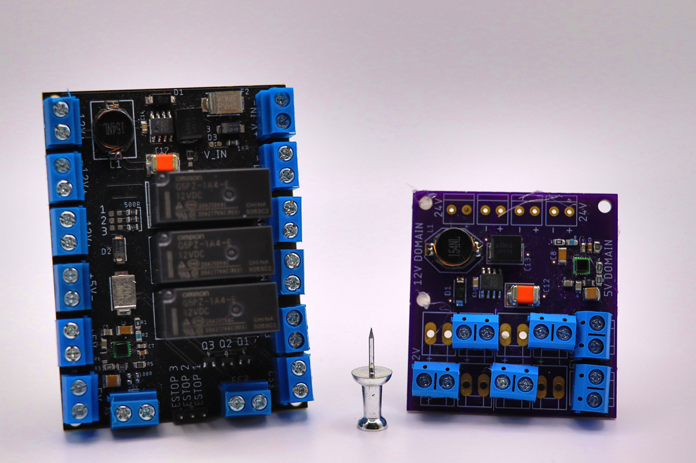

# Electrical Engineering Project Documentation Wiki

Welcome to the final documentation portal for RDS 2025 Electrical Team. This wiki provides a comprehensive view of the system architecture, development process, challenges faced, and recommendations for future iterations.

---

## Table of Contents

| Section                             | Description                                                 |
|-------------------------------------|-------------------------------------------------------------|
| [1. Original Architecture](#1-original-architecture)     | Initial ebedded system design, the primary driver of electrical hardware decisions |
| [2. Existing Tooling](#2-existing-tooling)               | The motor drivers, position sensors, MCU, and power domain tools alreafy in place as of 1 April 2025 |
| [3. Project Goals](#3-project-goals)                     | The Design Parameters and goals we agreed upon for Spring quarter '25    |
| [4. Project Plans and Backup Plans](#4-project-plans-and-backup-plans)  | The  plans and backup plans we agreed upon for Spring quarter '25    |
| [5. Project Outcome](#5-project-outcome)                 | Summary of results, deliverables, and performance           |
| [6. Issues and Painpoints](#6-issues-and-painpoints)     | Technical and procedural blockers encountered, and how we overcame them |
| [7. Future Work](#7-future-work)                         | Suggestions for extending and improving the project         |
| [8. Recommendations for Future Teams](#8-recommendations-for-future-teams) | Practical advice from this iteration, and how to pick up where we left off |
| [9. Appendix 1 Link to Drive and Altium Files](#9-appendix-1-link-to-drive-and-altium-files) | Links to our other shared resources |

---

## 1. Original Architecture

| Component         | Details                              |
|------------------|--------------------------------------|
| High-Level Control             | Laptop running ROS                      |
| Mid-Level Control              | Teensy 4.0             |
| Low-Level Control              | Teensy 4.0        |
| Joint Encoders                 | AS5047P to agggregating sensor board (palm board)     |
| Motor Encoders                 | AS5047P straight to mid-level teensy    |
| Power Domain                   | Power Distribution Board |
| Palm Board                     | Sensor Aggregation |

---

  
📷 Click to view Original System Diagram

  

---

## 2. Existing Tooling

| Component         | Details                              |
|------------------|--------------------------------------|
| Motor Driver & Logic/Control  | ODrive Pro            |
| Motor Driver                  | Ivor's Master's thesis, V1 and V2     |
| Power Distribution            | RDS2024 PDU           |
| Logic / Control               | RDS2024 Teensy 4.1 breakout board       |
| Position Sensing              | Pre-fabbed encoder boards from Mouser |

---

  
📷 Click to view ODrive

  

  
📷 Click to view Pre-fabbed Encoder

  

  
📷 Click to view RDS '24 Teensy 4.1 Breakout

  

  
📷 Click to view RDS '24 Power Board

  

  
📷 Click to view Ivor's Motor Driver

  

---

## 3. Project Goals

Our primary objective for Spring 2025 was to **consolidate disparate electrical subsystems** into a **modular, unified PCB stack** 

The existing tooling had several known drawbacks.

| Existing tool | Drawback |
|----------------|----------------------------|
|ODrive |Finicky SPI connectors, Exclusive support list for peripherals, Wasted Z space, Limited power output, Only drives one motor |
|Ivor's Boards | No Logic domain |
|Teensy 4.1 |Large Footprint, finnicky connectora for wire harnesses |
|RDS '24 PDU |Separate from other boards, does not readily accept wire harnesses |
|Prefabbed encoders|Large footprint, does not readily accept wire harnesses |

Our design goal was structured for **stackable, role-specific PCBs**, easing debugging, replacement, and scalability. The final layout aggregates all functional blocks into a clear topological arrangement, as shown below. Specifically, we wanted to handle:

| Domain                    | Responsibilities                                       |
|---------------------------|--------------------------------------------------------|
| 🟧 **Power Domain**        | 24V input → 5V regulation and stable power delivery    |
| 🟦 **Switching Domain**    | 40kHz gate driving and isolation switching logic       |
| 🟩 **Logic & Communication** | SPI, CAN, and MCU interfacing for control & telemetry |

  
📷 Click to view Modular Control Goal Diagram

    
  **Figure 3.** Modular PCB stack: domain separation by function with visual overlays and control pathways highlighted.

We defined success as:
- A **working modular board system** with power, logic, and switching blocks  
- Compatibility with **existing Teensy-based controllers**  
- Future-ready for **multi-channel motor drivers**

---

## 4. Project Plans and Backup Plans

| Plan Order       | Status / Result                      |
|------------------|--------------------------------------|
| A                |  Our custom board interfaces with a controlling teensy, and talks over CAN to a palm sensor board which aggregates data over SPI from encoders|
| B                |  Use our daughter board with Ivor's V2 motor driver |
| C                |  Use our daughter board with Ivor's V1 motor driver |
| D                |  Resort back to Odrive and any combination of logic which is compatible with that architecture|

---
## 5. Project Outcome
What we made!

| Component                  | Status / Result                                              |
|---------------------------|--------------------------------------------------------------|
| [Motor Driver & Logic/Control](MotorDriver.md) | Charlie's custom GaNFET motor driver, with 2x 3 phases |
| [Power Distribution](PD.md)        | Han's custom PCB for power distribution               |
| [Palm Board ](PalmBoard.md)     | Han's custom PCB with joint encoders                   |
| [Logic / Control](DaughterBoard.md)              | Caroline's custom PCB with motor encoders              |
| Motor Sensing                   | Jack's custom encoder boards (2 designs)               |
| Joint Position Sensing   | A third, custom 12mm wide encoder                      |

---
What actually ended up in the final design
| Component      | Status / Result                      |
|------------------|--------------------------------------|
| Motor Driver & Logic/Control      | ODrive for FOC               |
| Power Distribution                | Han's custom PCB            |
| Logic / Control                   | Han's custom PCB with 7 joint encoders    |
| Motor Sensing                     | Pre-fabbed encoder boards from Mouser |
| Joint Position Sensing            | Custom 12mm wide encoders  |
---
## 6. Issues and Painpoints

| Category          | Problem                              | Resolution / Notes                          |
|------------------|--------------------------------------|---------------------------------------------|
| Encoder sizing and wiring   | 10mm form factor requested by the mechanical team was exceedingly difficult. The encoder is 7mm wide, and locking molex connectors are larger than 10mm      |   12mm Circular encoders were soldered directly to vias. 10mm rectangular boards required the 5-pin SPI alternative approach               |
| Encoder wiring| 5-pin SPI was done incorrectly, with MOSI bridged to GND instead of 5V| 5 pin SPI being a risky hardware decision, double the 12mm circular encoders were ordered. Bridging pins on the rctangular form factors did work, but they were so fragile we abandoned it. Hot glue could have been explored, but enougn 12mm encoders existed to bypass the issue |
| SPI Communication           | After 4 encoders were connected to a single teensy, SPI would become unresponsive. While MUXing the SPI lines with separate CS pins, we added additional capacitance to the MISO line with each additional encoder.        |  4 Teensy boards were required to achieve 16 joint and SEA encoders. In future iterations, it is recommended to use a MUX IC which physically disconnects MISO lines, bypassing the issue of additional parasitic capacitance.                |
| CAN power                   | Our daughter board was designed to use 5V for CAN, while the ODrive uses 12V.        |  We pivoted to Han's boad and disconnected the power domain and reconnected a 12V domain.                |
| Custom Motor Driver         | There was an issue in which the CS pin was preventing normal control of the motors        | Fixed the CS pin                 |
| Custom Motor Driver         |After fixing the CS pin, the board caught fire due to overheating or a short      | Ongoing, we are next looking at scheduling a customer service call with TI             |
| Teensy 4.0 Daughter Board   | Incorrect CS pins and CAN power wiring        |   Cut traces and jumper wire               |
| PDU board  | Flipped CAN connector    |   Flip wires around             |

[Additional List (Unorganized) of Integration Issues](IntegrationIssues.md)
---

## 7. Future Work

| Area              | Next Steps                           |
|------------------|--------------------------------------|
| Motor Driver         | Schedule call with TI to debug GaNFET overheating issue and our setup|
| Encoders             |Fix the wiring issues |
| Daughter board       |Fix the wiring issues |
| Daughter board       |Get rid of teensy header pins for fully integrated logic. Note:only when we stop breaking teensys |
| PDU board            |Fix the wiring issues |

---

## 8. Recommendations for Future Teams

| Tip                                      | Why It Matters                               |
|------------------------------------------|-----------------------------------------------|
| Order extremely early          | Hardware never works 100% the first time. Plan to order twice     |
| Do not plan to make your own wire harnesses. Try and make QWIIC or something COTS work     | Not a good time. Eats up many many hours you did not account for    |
| Add test points and jumpers for current readings          | Hardware never works 100% the first time. Plan to  debug    |
| Order 2x what you think you may need         |You will have to pivot and you will also break things. Have room to bend not break  |
| Pursue 2 options at once       | Our team was big enough for someone to freelance and build their own version. This saved us because it was compatible with ODrive.  |
|Be backward compatible | Plan to resort to the previous generation. Whether that is ODRive or something else, make sure what already works will continue to work before getting fancy and adding stuff |
|Materials you didnt think about | Wiring harnesses, shrink wrap, braided wire, crimping tools|
|Equipment you didnt think about | The 3 separate benchtop power supplies is gross. Getting an all-in-one with current limits would be nice. Think about power distribution too. Look at how many wires are on our device- it gets out of control fast and can be minimized. Even with our original plan, wire routing would have been somewhat messy. I recommend making the power domain much prettier and more professional|

---

## 9. Appendix 1 Link to Drive and Altium Files

| Board | GDrive Link | Altium Link |
|-------|-------------|-------------|
|Motor Driver |[Gdrive](https://drive.google.com/drive/folders/1xZUM3Zf5BXCYf7R72Dv3WHtOntPb45lc?usp=drive_link) | [Altium](https://yufeng-yang.365.altium.com/designs/1C79E01F-E16E-4C25-9A8B-15B832A2B849#design) |
|Daughter Board |n/a |https://yufeng-yang.365.altium.com/designs/9186B018-A3EC-4A0F-9E85-4ADB772EB47A?activeDocumentId=Sheet1.SchDoc&variant=[No+Variations]&activeView=SCH&location=[1,95.65,25.44,33.63]#design|
|PDU | n/a|n/a|
|Palm Board |n/a|https://yufeng-yang.365.altium.com/designs/514BBF15-76C4-44B1-B00E-D776AEB88471?activeDocumentId=Sheet1.SchDoc&variant=[No+Variations]&activeView=SCH&location=[1,99.77,-0.01,27.05]#design |
|Encoder  |n/a |https://yufeng-yang.365.altium.com/designs/3C7BD1D0-1197-4904-B1E8-0A32D0BF4D44?activeDocumentId=encoder.SchDoc&variant=[No+Variations]&activeView=SCH&location=[1,100.58,0,22.35]#design|

