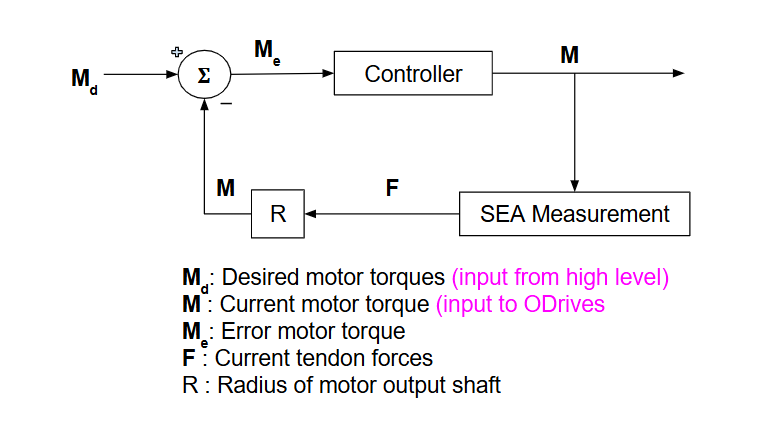

# RDS 2025 Project - Robotic Hand Control System

## Project Overview

The RDS 2025 project is a sophisticated robotic hand control system featuring three integrated subsystems: a 2-DOF wrist, a 4-DOF dexterous finger, and a 1-DOF power finger. The system employs Series Elastic Actuators (SEAs) for compliant control, tendon-driven mechanisms for compact design, and distributed control architecture across multiple microcontrollers.

### Key Features
- **Wrist Control**: 2-DOF (pitch and yaw) 
- **Dexterous Finger**: 4-DOF (PIP, DIP, MCP, Splay) with coupled tendon actuation between PIP and MCP
- **Power Finger**: 1-DOF grasp mechanism with high force capability
- **Force Control**: Series Elastic Actuators with real-time force feedback
- **Distributed Architecture**: Multi-MCU system with CAN bus communication

## System Architecture

### Workflow 


### Repo Structure
```
High-Level Controller (Teensy 4.1)
├── State Management & Coordination
├── Joint-Level Control (Position/Force)
├── Tendon Kinematics & Coupling
└── CAN Communication Hub

Low-Level Controllers (Teensy 4.1)
├── SEA Force Control
├── Motor Current Control
├── Encoder Feedback
└── Load Cell Integration

Palm Controller (Teensy 4.0)
├── Multi-Encoder Reading (8 channels)
├── SPI Communication
└── Joint Angle Feedback
```

### Mathematical Foundation

#### Tendon Kinematics
The system uses a Jacobian-based approach for tendon-to-joint mapping, with each motor's velocity mapped to its respective actuating joint's velocity through a tendon routing matrix, an example for which is shown in dex finger below:

**Dexterous Finger Jacobian:**
```
J_dex = [ 1.0  -2.0  -1.2  -1.2]
        [-1.0   0.0   0.0   0.0]
        [-1.0   2.0   1.2   1.2]
        [ 1.0   2.52  1.2   1.2]
```

More information on wrist coupling and power finger can be found in the Mechanical documentation linked below. 

**Motor Torque Calculation:**
```
τ_motor = (1/R_motor) * (J * τ_joint + τ_null)
```

Where:
- `R_motor = 5.0mm` (motor pulley radius)
- `τ_null` provides null-space control for tendon pretension

#### Series Elastic Actuator (SEA) Calibration
Force-deflection relationships were experimentally determined for each SEA:

```cpp
// Example SEA characteristics
SEA_2: F = 0.206 * θ                    (Linear)
SEA_3: F = 0.972 * θ - 0.00432 * θ²     (Quadratic)
SEA_4: F = 0.829 * θ - 0.00714 * θ²     (Quadratic)
```

## Hardware Integration

### Sensor Systems
- **Encoders**: AS5047P magnetic encoders (14-bit resolution)
- **Force Feedback**: SEA measurements taken through encoder ans spring calibrated through NAU7802 load cells
- **Motor Control**: ODrive motor controllers via CAN bus

## Control Implementation

### Position Control
The system implements cascaded PD control with anti-windup:


### Force Control
SEA-based force control with PD gains:



## Communication Protocol

### Serial Command Interface
The system accepts commands in the format `ID:value1 value2 ...`:

```
Command Examples:
10:30.0 15.0 45.0 30.0 15.0 0.0 60.0  // Set all joint positions
20                                      // Emergency stop
30                                      // Get system status
```

### CAN Bus Architecture
- **Baud Rate**: 250 kbps
- **High-Level**: Joint coordination and state management
- **Low-Level**: Motor control and sensor feedback
- **Palm**: Multi-encoder data acquisition

## GUI and Monitoring

### Python Control Interface
A comprehensive Tkinter-based GUI provides:
- Real-time joint position control
- Force/position data recording
- System monitoring and diagnostics
- Preset hand configurations

### Data Visualization
```python
# Real-time pitch/yaw recording with statistical analysis
def plot_recorded_data(self):
    pitch_error = np.array(pitch_desired) - np.array(pitch_actual)
    yaw_error = np.array(yaw_desired) - np.array(yaw_actual)
    
    rms_error_pitch = np.sqrt(np.mean(pitch_error**2))
    rms_error_yaw = np.sqrt(np.mean(yaw_error**2))
```

## Experimental Results

### SEA Force Characterization
Each SEA was individually calibrated to determine force-deflection relationships:
- **Linear SEAs**: Simple proportional relationship (SEA_2, SEA_5, SEA_6)


- **Nonlinear SEAs**: Quadratic compensation required (SEA_3, SEA_4, SEA_7, SEA_8)


### Force Control Validation


Load cell feedback demonstrates:
- **Force accuracy**: ±0.1N at 5N maximum
- **Response time**: <100ms for force steps
- **Stability**: No oscillations observed in normal operation

## System Performance

### Strengths
1. **Modular Architecture**: Clean separation of concerns across subsystems
2. **Real-time Performance**: 100Hz control loop with deterministic timing
3. **Force Feedback**: Accurate SEA-based force control enables compliant manipulation
4. **Comprehensive Monitoring**: Extensive logging and visualization capabilities
5. **Robust Communication**: CAN bus provides reliable inter-controller communication

### Areas for Improvement
1. **Tendon Coupling**: Complex interdependencies require careful tuning
2. **Calibration Complexity**: Each SEA requires individual characterization
3. **Range Limitations**: Some joints have restricted ROM due to mechanical constraints
4. **Force Limits**: Current SEA design limits maximum force output
5. **Hardware Configuration**: Better architecture design to account for changes in hardware

### Future Enhancements
1. **Feedforward Control**: Using feedforward + PD control to enhance control of large subsystems
2. **Motor Drivers with SimpleFOC**: Using custom motor drivers with Arduino-SimpleFOC library
3. **Integration of Control Loops**: All control loops working in their layer of abstraction together
4. **Kinematic Integration**: Control of integrated mechanical system with kinematic integration

## Project Documentation

### Code Repositories
- **High-Level Control**: `/high-level/src/` - State management and coordination
- **Low-Level Control**: `/low-level/src/` - Force control and motor interfaces  
- **Palm Interface**: `/palm/src/` - Multi-encoder sensor reading
- **GUI Applications**: `/GUI/` - Python control interfaces

### Hardware Documentation
- **Mechanical Design**: CAD files and assembly drawings [https://docs.google.com/document/d/17M-Oa2aqqSKGwONml3L1aWp2K_8TE4KUtSQWIA2iMCw/edit?tab=t.yf60ihlam0il#heading=h.n3ni8fpki7n9]
- **Electrical Schematics**: PCB designs and wiring diagrams (found in Electrical Documentation folder in repo)
- **Calibration Data**: SEA force curves and sensor offsets

## Getting Started

### Prerequisites
- PlatformIO for microcontroller development
- Python 3.8+ with matplotlib, numpy, tkinter
- CAN bus hardware (ODrive controllers)

### Quick Start
1. **Hardware Setup**: Connect encoders, load cells, and CAN devices according to electrical architecture
2. **Firmware Upload**: Flash appropriate code to each Teensy controller
3. **Calibration**: Run encoder offset and SEA force calibration procedures
4. **GUI Launch**: Execute `python GUI/PhaniGUI.py` for system control
5. **Testing**: Use preset configurations to verify system operation

### System Commands
```bash
# Compile and upload high-level controller
cd high-level && pio run -t upload

# Launch monitoring GUI  
python GUI/PhaniGUI.py

# Run force control validation
python GUI/SerialGUI.py
```

---

*For detailed technical documentation, calibration procedures, and troubleshooting guides, refer to the complete project repository and associated technical reports.*
